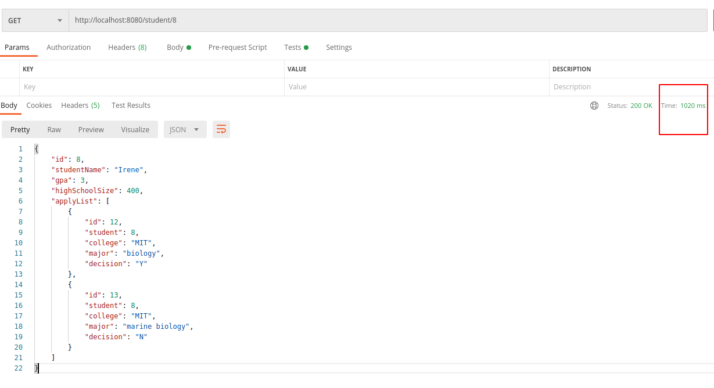
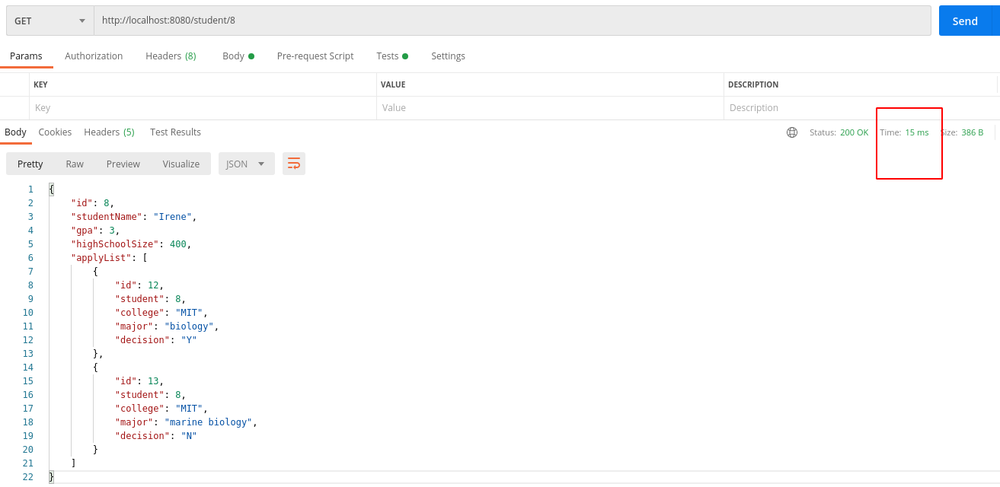

# Spring-demo
Spring Boot CRUD demonstrating the use of PostgreSQL db running inside Docker container and Redis as cache (also running inside Docker container) .

To run Redis and Docker containers: 
```
docker run --name my-redis-container -p 6379:6379 -d redis:6.0.9-alpine
docker run --name my-postgres-container -e POSTGRES_PASSWORD=mysecretpassword -p 5432:5432 -d postgres:13.1-alpine
```
Make sure that parameters from above commands align with application.properties file.

Check that Flyway created tables and populated them in postgres public schema with .sql scripts from main/resources/db.migration by entering Postgres container : 

```
  docker exec -it my-postgres-container bash
  
  psql -U postgres
  
  \dt
  
  select * from student; (or other table)
```


I added timeouts of 1sec to GET/{id} endpoints so difference to a call which goes to a database compared to cached content is visible to a human eye.



By calling GET in Postman for some id for the first time you can see time will be ~1sec, compared to a second call for same id which will be approximately 100x faster.



## TODO:

1) Add basic security with JWT
2) Add testing and get familiar with Testcontainers library
3) Add some non-trivial SQL queries and get familiar with jOOQ library
5) Pagination and JpaAuditing, Projections/Views
6) Jacoco and Sonarqube
